# 互联网络程序设计课程报告

## 简易FTP服务器的实现

### 要求
关于互联网络程序设计这门课程的报告题目，我选择的是设计并实现一个FTP服务器，题目大致的要求为：

- 库函数使用要求
	- 使用EPOLL；
	- 采用非阻塞模式；
	- 采用ET模式。
- 实现基本的FTP命令语义
	- LS：显示指定目录的文件结构（默认当前目录）；
	- CD：切换当前目录；
	- GET：传输指定文件到客户端；
	- PUT：接收上传文件到制定目录。
- 测试要求
	- 测试用例要覆盖主要的需求；
	- 测试报告应该给出测试环境、测试用例、测试结果；
	- 测试结果中必须包含截图。
- 语言要求
	- 要求使用C/C++语言，应用现代程序设计思想。
- 其他
	- FTP客户端不作要求；

### 要求分析

从总体要求来看，需要设计并实现的程序就是要模拟FTP，使用户能够登录到服务器并进行目录的浏览、文件的上传与下载等功能。

从库函数的使用要求来看，需要使用到epoll系统调用。epoll是Linux特有的I/O复用函数，它在实现和使用上与select、poll有很大差异。首先，epoll使用一组函数来完成任务，而不是单个函数。其次，epoll把用户关心的文件描述符上的事件放在内核里的一个事件表中，从而无须向select和poll那样每次调用都要重复传入文件描述符或事件集。但是epoll需要使用一个额外的文件描述符，来唯一标识内核中的这个事件表。

采用非阻塞模式要求对文件描述符上的读写操作能够立即返回而不是等待操作成功之后返回，操作的结果是否成功由之后的通知或者轮询获得。非阻塞模式可以使用fcntl调用对文件描述符添加O\_NONBLOCK标志实现。

ET（Edge Trigger，边沿触发）是epoll对文件描述符的两种操作模式之一（另一种为LT。Level Trigger，电平触发）。LT模式是默认的工作模式，这种模式下epoll仅相当于一个效率较高的poll，而ET模式是epoll的高效工作模式。对于采用LT工作模式的文件描述符，当epoll\_wait检测到其上有事件发生并将此事件通知应用程序后，应用程序可以不立即处理该事件。这样，当应用程序下一次调用epoll\_wait时，epoll\_wait还会再次向应用程序通告此事件，直到该事件被处理。而对于ET工作模式的文件描述符，当epoll\_wait检测到其上有事件发生并将此事件通知应用程序后，应用程序必须立即处理该事件，因为后续epoll_wait调用不再向应用程序通知这一事件。当往epoll内核事件表中注册一个文件描述符上的EPOLLET事件时，epoll将以ET模式来操作该文件描述符。

而FTP基本命令语义的要求，如LS命令的要求时显示指定目录的文件结构，CD命令的要求是切换工作目录，PUT/GET则是文件传输要用到的命令。

最后要求使用C/C++语言，应用现代程序设计思想实现以上要求功能并进行完整的测试。

### 设计与实现

由于我使用的是MacOS High Sierra系统，没有sys/epoll.h该头文件，即没有Linux系统特有的epoll系统调用。为了方便代码的编写与调试，使用本地系统另一个头文件sys/event.h（实现原理、底层与epoll相同但是名称不同）代替，下面简单列举它们的相同点与不同点：

| 系统调用的功能 | Linux | MacOS |
| :-: | :-: | :-: |
创建标识内核中事件表的文件描述符 | int epoll_create(int size) | int kqeue(void)
操作内核事件表 | int epoll\_ctl(int epfd, int op, int fd, struct epoll\_event *event) | int kevent(int kq, const struct kevent *changelist, int nchanges, truct kevent *eventlist, int nevents, const struct timespec *timeout)
在一段超市时间内等待一组文件描述符的事件 | int epoll\_wait(int epfd, struct epoll\_event *event, int maxevents, int timeout) | 同上

上表值得注意的是，macOS系统下，操作内核事件表与等待事件的发生使用的是同一个系统调用，具体使用哪一个功能取决于它的参数。当第四、第五两个参数为空时，该系统调用表示修改内核中对应的事件表；当第二、第三两个参数为空时，该系统调用表示等待一组文件描述符上的事件发生。

| 事件类型/标志位/响应动作 | Linux | MacOS |
| :-: | :-: | :-: |
数据可读 | EPOLLIN | EVFILT_READ 
数据可写 | EPOLLOUT | EVFILT_WRITE
边沿触发（ET） | EPOLLET | EV_CLEAR
ONESHOT | EPOLLONESHOT | EV_ONESHOT
发生错误 | EPOLLERR | EV_ERROR

从上面两张表中可以看出，常用的epoll系统调用及操作都能够在macOS上找到相对应的功能。

下面是整个程序总体上的流程：启动程序等待客户端连接与客户端连接成功解析用户输入的指令执行指令返回结果。
上述流程每个阶段都会有相应的错误处理，为了实现上述总体的流程，需要实现以下功能（面向对象编程，使用类的名称代表对应的功能）。

- Server，服务器主类。主要负责的工作有：SOCKET的初始化、文件描述符的管理、注册事件、处理事件，以及启动程序运行所需的各个模块，例如初始化读取配置文件的Properties对象，解析命令的CommandParser对象，执行命令的CommandExecutor对象和操作文件的FileOperation对象。
- Properties，配置选项管理器。程序运行所需的关键参数存储在一个配置文件中，Properties主要负责在程序启动时，将配置文件中的简直对保存在一个map中供程序使用。主要的配置选项包括对程序工作目录、服务绑定地址、服务监听端口、文件传输端口、用户读写文件权限的设置。
- CommandParser，命令分析者。主要负责将用户输入的字符串解析成为Command对象。
- CommandExecutor，命令执行者。主要负责执行由CommandParser生成Command对象。
- FileOperations，文件操作。主要负责提供操作文件的常用函数，例如读取文件的属性、判断某一个路径是否是目录、判断某个文件是否可读可写可执行等

#### Properties

配置选项管理器，从文件中读取并保存程序运行所需的必要参数。其实现的方法如下图所示：

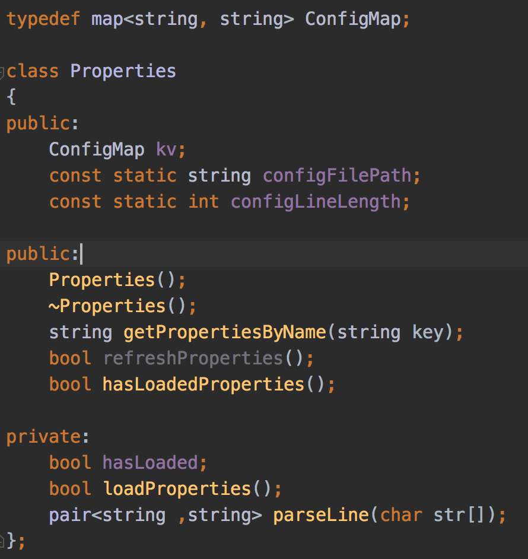

配置文件的内容如下所示：

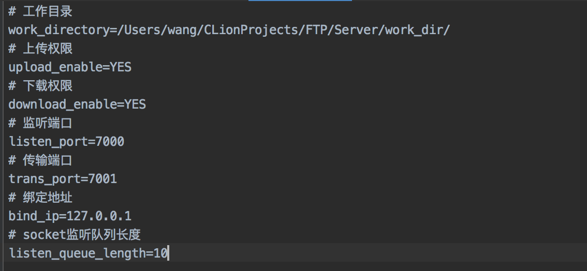

#### FileOperations

文件操作工具类。主要负责提供操作文件的常用函数，例如LS命令需要用到的读取指定目录下的文件结构。其实现的方法如下：

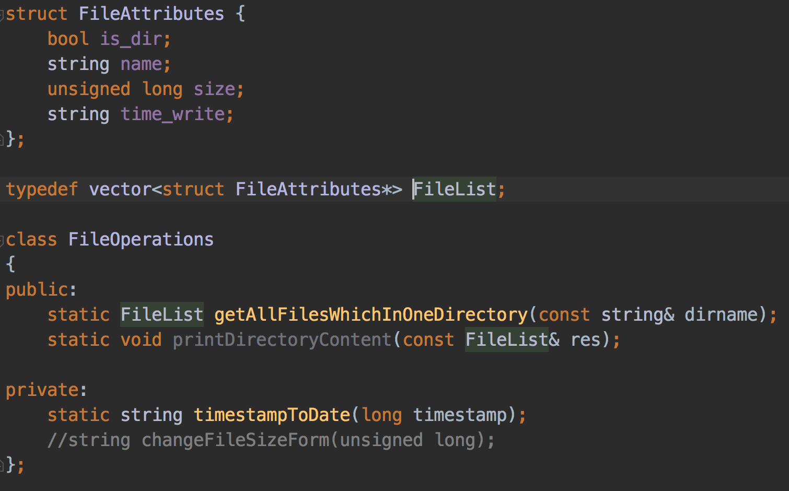

#### CommandParser

命令分析器，要负责将用户输入的字符串解析成为Command对象。Command结构体如下所示，CommandType表示该命令的类型，而firstParameter和secondParameter是命令的两个参数（不考虑子命令）。参数可能部分为空，例如CD命令只需要一个参数；也有可能全为空，例如LS，此时它代表显示当前目录的文件结构。

```
enum CommandType {
    OPEN, LS, CD, GET, PUT
};

struct Command {
    CommandType type;
    string firstParameter;
    string secondParameter;
};
```

Command对象的生成较为简单，只需要在字符串中，以空格为分界线，取三段字符串，最后逐一检查字符串的合法性就可以生成。生成的关键在于，对于LS、CD、PUT、GET命令需要额外的操作，例如下图所示的例子。

```
ftp> ls ../
# 显示上一级目录的文件结构
ftp> cd  /1/../.././2/3/../4
# 切换到指定目录，参数较为复杂
ftp> get /1/test.txt ./download
# 将服务端绝对路径为 /1/test.txt 的文件下载到当前目录中的 download目录中
ftp> put ./upload/test.txt ./2/3/4
# 将本地文件上传到服务端的，从当前目录出发，2/3/4/ 的目录下
```

从上面不难看出，对于这些命令，非常重要的一点是将目标文件或目录的绝对路径计算出来。此处的实现利用了有限状态自动机的思想，起始时为当前路径，将目标路径的字符串转化为字符数组，每读入一个字符就进入下一个状态并将偏移量增加，直到读完，如下图所示。计算时还会去除多余的 '.' 符号，这样就得到了目标文件或目录的绝对路径（相对于工作目录）。

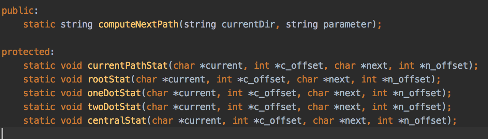

#### CommandExecutor

命令执行者。主要负责执行由CommandParser生成Command对象，实现的方法如下所示：

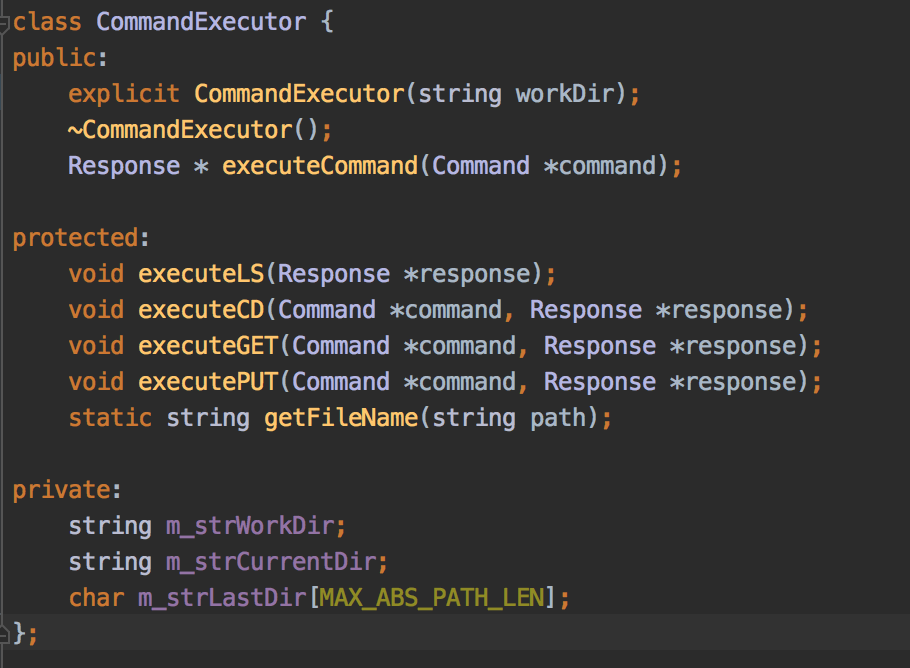

CommandExecutor的属性成员有：

- m_strWorkDir：真实系统的绝对路径；
- m_strCurrentDir：用户所在虚拟空间的绝对路径；
- m_strLastDir：用户上一次所在目录的绝对路径。

之所这么设计，是因为登录到FTP服务器的用户只被允许访问指定的目录，不用不够能使用CD命令进入到真实系统环境中，也不能够使用其他命令获取到真实系统中的相关信息。

在执行GET和PUT指令时，如果命令各项参数没有异常，那么执行时会开启一个线程，启动新的服务去监听文件传输的端口，如果启动成功，那么成功的消息就会随着Response对象传回给客户端，之后客户端就连接到新的服务去完成文件的传输。

#### Server

初始化对象，初始化Properties对象后，从中获得运行所必须的参数初始化类中的成员，最后初始化CommandExecutor如下图所示：

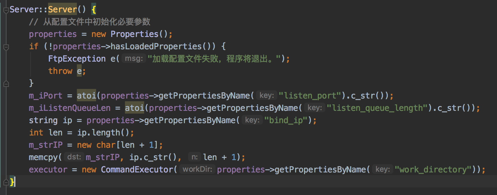

启动服务，完成的工作有：初始化SOCKET、绑定地址、监听端口、注册事件、开启ET模式，如下图所示：

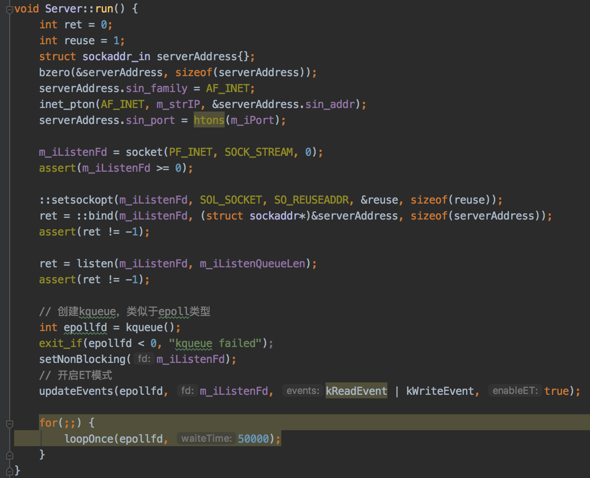

处理事件，在规定的超时时间内等待一组文件描述符上的事件发生，根据不同的文件描述符和不同的事件，交由handleAccept、handleRead、handleWrite其中一个处理，如下图所示：

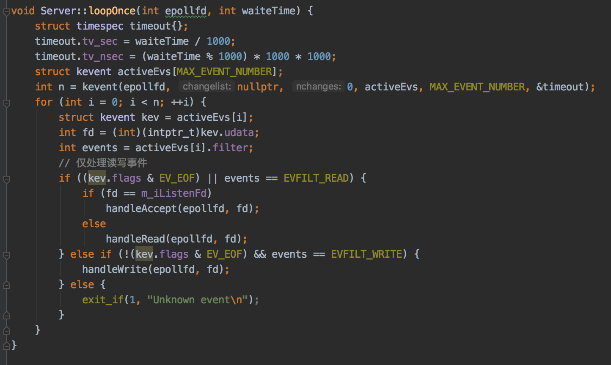

着重展示handleRead函数，其主要负责使用CommandParser将接收到数据变为Command对象，然后将Command对象交给CommandExecutor执行，最后将执行结果Response对象序列化后发送给客户端，如下图所示：

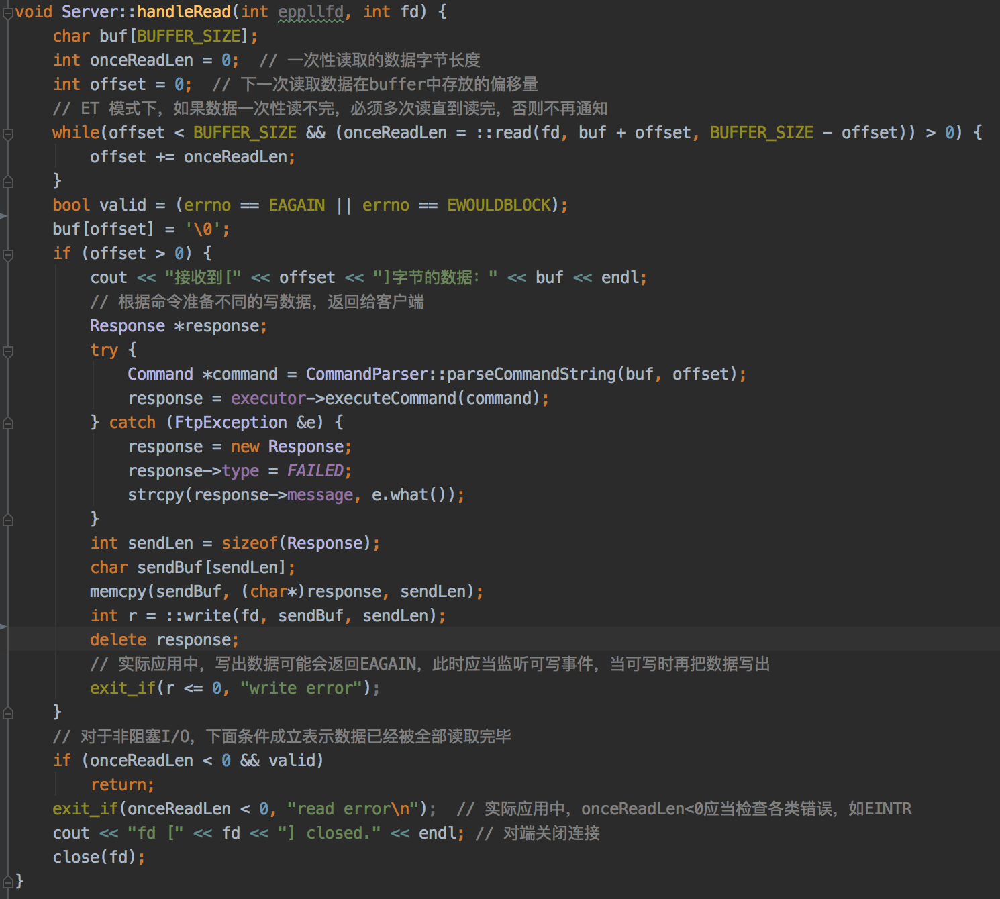

### 测试

1. 使用 `dd`命令在工作目录下生成大小为10MB的测试文件

	```
	dd if=/dev/zero of=test.txt bs=10m count=1
	```
	
2. 工作目录内的树形结构如下:

	```
	work_dir
	├── 1
	│   └── 2
	│       └── 3
	│           └── 4
	└── test.txt

	4 directories, 1 file
	```
	
3. 启动FTP服务端
4. 启动FTP客户端
5. 测试指令LS，如下所示

	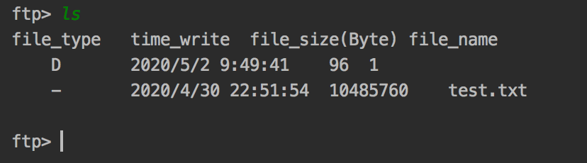
	
6. 测试指令CD，如下所示

	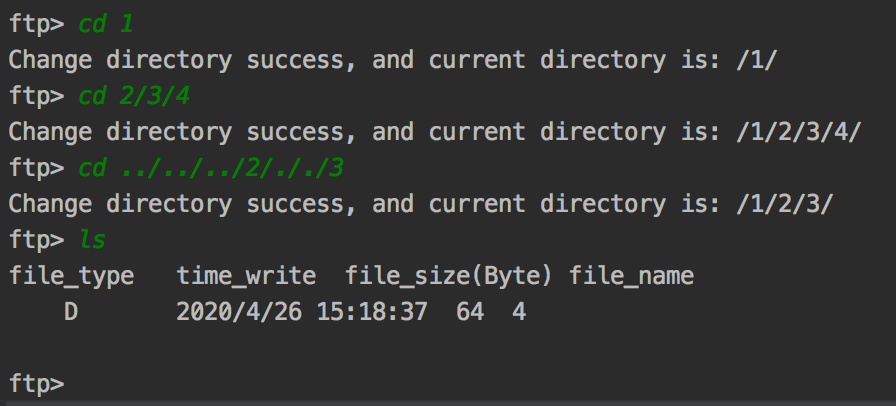
	
7. 测试指令GET，将/work_dir目录下的test.txt下载到本地，客户端与服务端输出分别如下所示

	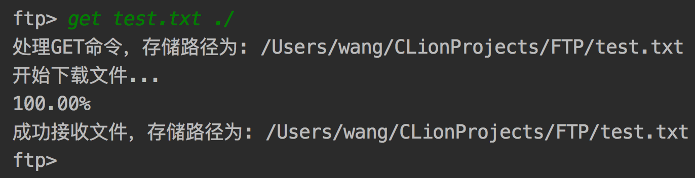
	
	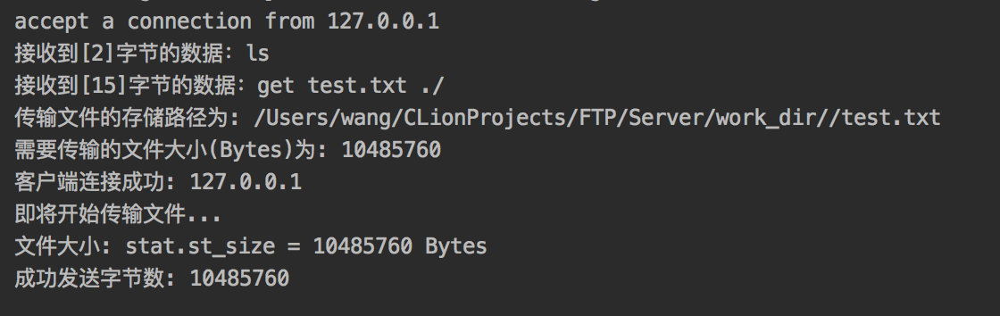
	
8. 测试指令PUT，将刚才下载到本地的文件上传到/work_dir/1/2/3/4/目录下，客户端与服务端输出分别如下所示

	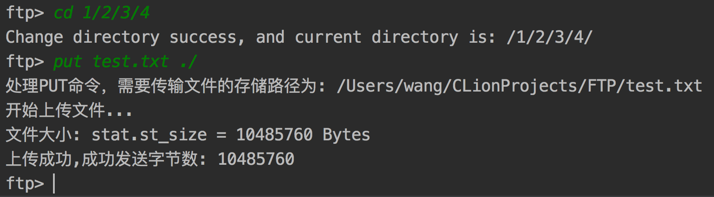
	
	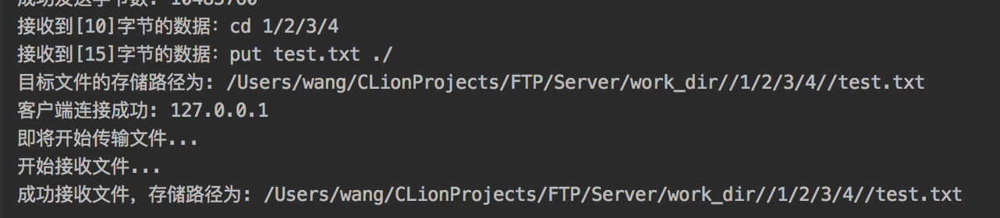
	
9. 现在的树形目录结构

	```
	work_dir
	├── 1
	│   └── 2
	│       └── 3
	│           └── 4
	│               └── test.txt
	└── test.txt
	
	4 directories, 2 files
	```

10. 客户端输入`exit`退出程序
